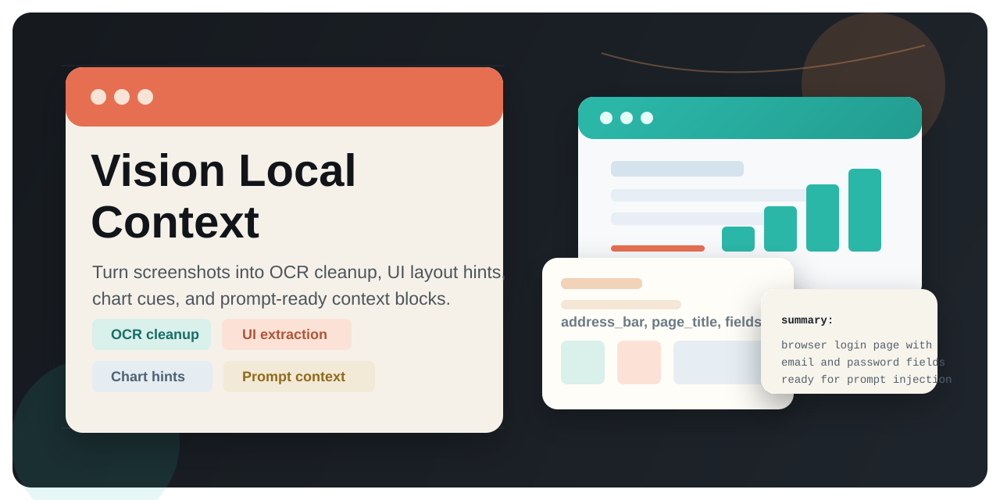
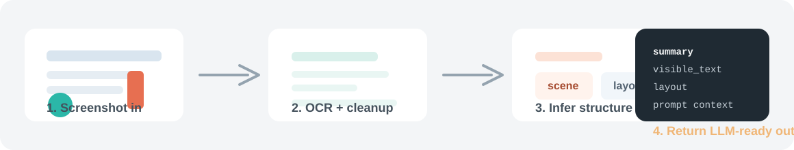

# Vision Local Context

<p align="center">
  
</p>

<p align="center">
  <a href="https://github.com/agent-wrangler/vision-local-context/actions/workflows/ci.yml">
    
  </a>
  <a href="https://github.com/agent-wrangler/vision-local-context/blob/main/LICENSE">
    
  </a>
  <a href="https://github.com/agent-wrangler/vision-local-context">
    
  </a>
</p>

<p align="center">
  <strong>Windows-first local screenshot understanding for OCR, UI layout extraction, and LLM-ready prompt context.</strong>
</p>

<p align="center">
  One screenshot in, structured context out.
</p>

`vision-local-context` sits in the practical middle layer between raw screenshots and a chat model. It is built for workflows where you do not want to make a multimodal API call for every image turn, but you still want useful local understanding of browser pages, chat windows, settings screens, dashboards, and documents.

Windows OCR remains the strongest local path, and the package now supports a Tesseract-based OCR fallback for macOS and Linux environments where the `tesseract` CLI is installed.

## At a Glance

| Input | Understands | Returns |
| --- | --- | --- |
| screenshots, browser tabs, chats, dashboards, settings pages | OCR text, scene type, layout hints, chart cues | `summary`, `visible_text`, `layout`, and prompt-ready context |

## Why This Exists

- turn screenshots into structured prompt context instead of raw OCR dumps
- recover useful UI labels from noisy OCR output
- detect common screen types such as browser, chat, chart, settings, and document
- extract browser-style and chat-style layout hints for downstream tools or agents
- keep the integration surface small: one module, a few entry points, and plain Python dictionaries

## How It Works

<p align="center">
  
</p>

1. Decode the uploaded image and run local OCR.
2. Clean up noisy short labels and stabilize text fragments.
3. Infer scene type, browser or chat layout hints, and basic chart structure.
4. Return structured output that can drop straight into an LLM prompt or agent workflow.

## Core Entry Points

- `analyze_image(image_b64)` returns structured analysis for one image
- `build_user_image_context(images, user_text="")` builds a prompt-ready context block for one or more images
- `build_screen_description(image_b64)` returns a compact one-line description

The module also exposes capability probes:

- `has_windows_ocr_support()`
- `has_tesseract_ocr_support()`
- `has_caption_support()`
- `get_local_image_capabilities()`
- `has_local_image_support()`

## Typical Output

`analyze_image(image_b64)` returns a dictionary shaped roughly like this:

```python
{
    "ok": True,
    "ocr_backend": "windows",
    "scene": "browser",
    "summary": "This appears to be a browser or website page.",
    "visible_text": "https://example.com/login Example Login Email Password Sign in",
    "layout": {
        "kind": "browser",
        "address_bar": "https://example.com/login",
        "page_title": "Example Login",
        "field_labels": ["Email", "Password", "Sign in"],
    },
}
```

Typical fields include:

- OCR backend used, such as `windows` or `tesseract`
- scene type such as `browser`, `chat`, `chart`, `settings`, or `document`
- cleaned visible text
- layout details like address bar, page title, sidebar labels, and input hint
- chart details such as title, axis labels, and trend hints
- a plain-language summary that can be injected into a prompt

## Install

Clone the repository and install from source:

```bash
git clone https://github.com/agent-wrangler/vision-local-context.git
cd vision-local-context
pip install .
```

For optional caption-model support:

```bash
pip install ".[caption]"
```

For tests:

```bash
pip install ".[test]"
python -m pytest -q
```

For local development and release checks:

```bash
pip install -e ".[dev]"
python -m pytest
python -m build
```

## Quick Start

```python
import base64
from pathlib import Path

from vision_local import analyze_image, build_user_image_context

image_b64 = base64.b64encode(Path("example.png").read_bytes()).decode("ascii")

analysis = analyze_image(image_b64)
print(analysis["scene"])
print(analysis["summary"])

context = build_user_image_context(
    [image_b64],
    user_text="What is on this screen?",
)
print(context)
```

## Platform Notes

- OCR currently uses Windows OCR through PowerShell and Windows Runtime APIs.
- When Windows OCR is unavailable, the package can fall back to the `tesseract` command-line OCR engine if it is installed.
- Optional caption generation uses BLIP through `transformers` and `torch`.
- The package can be imported, tested, and OCR-enabled on non-Windows platforms when Tesseract is available.
- Windows remains the preferred OCR backend when both backends are present.

## Configuration

Optional environment variables:

- `VISION_LOCAL_CONTEXT_OCR_TIMEOUT_SECONDS`
- `VISION_LOCAL_CONTEXT_OCR_BACKEND`
- `VISION_LOCAL_CONTEXT_TESSERACT_LANG`
- `VISION_LOCAL_CONTEXT_TESSERACT_PSM`
- `VISION_LOCAL_CONTEXT_CAPTION_BLOCKING`
- `VISION_LOCAL_CONTEXT_CAPTION_ALLOW_DOWNLOAD`
- `VISION_LOCAL_CONTEXT_CAPTION_MODEL`

## Project Status

This is an early standalone extraction of a local vision-context layer. The current scope is intentionally narrow: keep the core analysis module clean, testable, and easy to embed into another agent or chat runtime.

Near-term priorities:

- continue hardening OCR cleanup and layout extraction heuristics
- expand screenshot coverage with more regression fixtures
- keep the public API small and stable

## Repository Layout

- `vision_local.py`: main module
- `tests/test_vision_local_context.py`: regression tests for OCR cleanup, layout inference, and chart heuristics
- `.github/workflows/ci.yml`: test and packaging checks for pushes and pull requests
- `CHANGELOG.md`: release notes

## Development

1. Create a virtual environment with Python 3.10 or newer.
2. Install editable dependencies with `pip install -e ".[dev]"`.
3. Run `python -m pytest` before opening a pull request.
4. Run `python -m build` before tagging a release.

GitHub Actions runs the test suite on Windows and Linux and performs a packaging check on every push and pull request.
It also includes a dedicated Ubuntu OCR integration job that installs Tesseract and exercises the fallback backend against a real generated fixture.

## Contributing

See [CONTRIBUTING.md](./CONTRIBUTING.md) for local setup, pull-request expectations, and release checks.

## License

MIT
